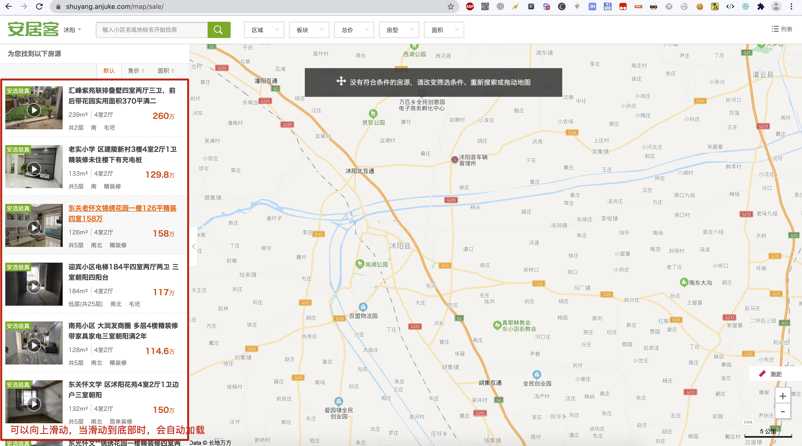
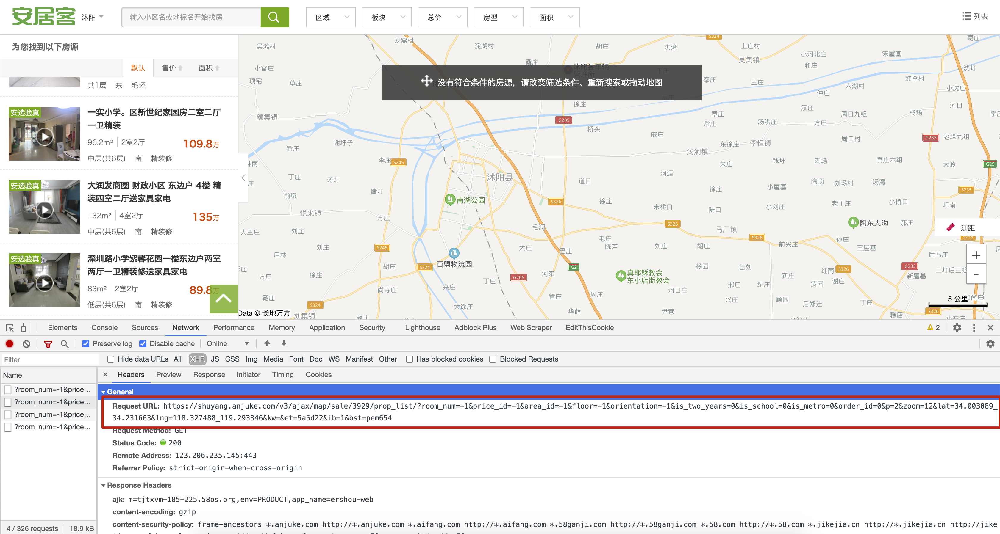
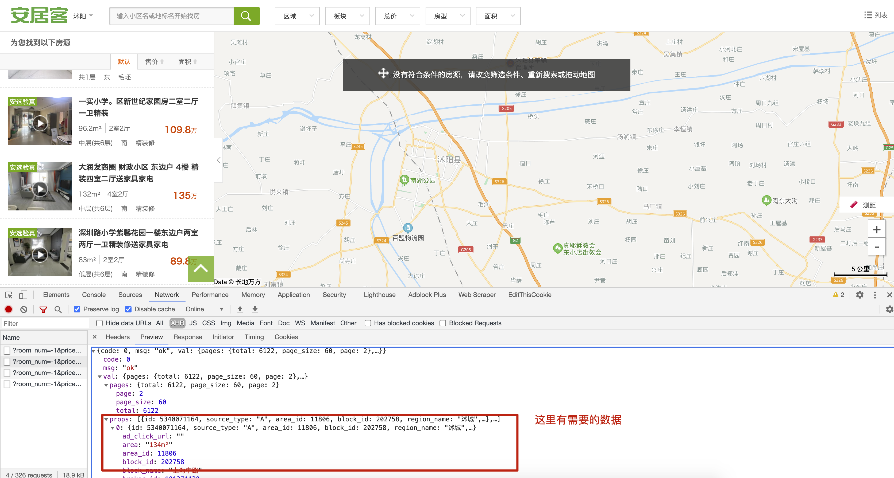
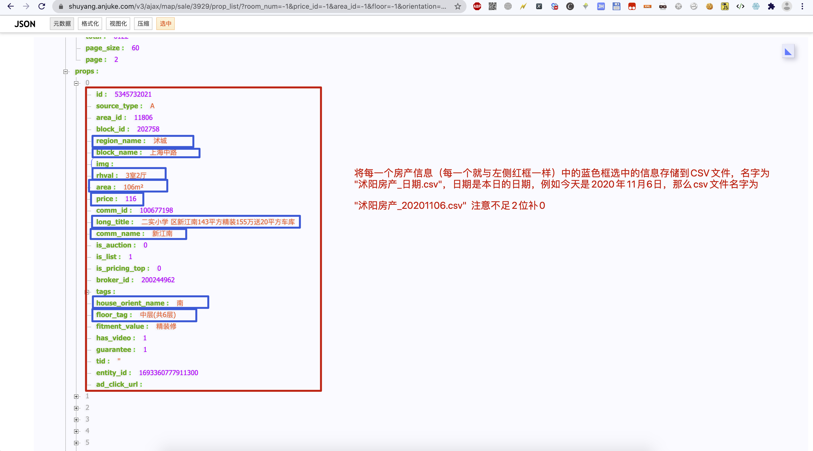
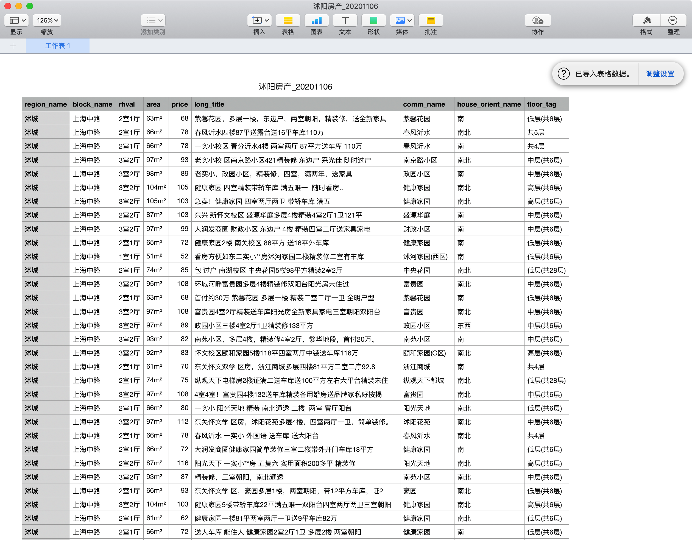

## 一、要求整体描述

### 1. 功能要求

编写代码实现“安居客”网站“沭阳”的房产信息爬取，且存储到CSV文件，爬取数量为至少120条

### 2. 提交要求

新建pycharm项目，且用git进行管理，将最后编写的代码+csv文件都使用git管理后push到远程仓库

且将远程仓库权限改为“公有”，将URL以及自己姓名添加到如下文档中

https://shimo.im/sheets/QYcRPPtxQQPrcDPW/MODOC/

## 二、详细描述

安居客url：https://shuyang.anjuke.com/map/sale/

1.下图左侧可以上滑动加载更多

2.仔细分析能够找到加载更多的时候的URL，以及响应

3.从下载的信息中提取下图标记的数据

根据上图描述，存储到合适的cvs文件

## 三、最后效果

## 四、分数说明

| 分数（总分100） | 功能描述                                              |
| --------------- | ----------------------------------------------------- |
| 20              | 能够使用requests下载数据                              |
| 20              | 能够使用jsonpath解析出需要的数据                      |
| 30              | 能够将制定的需要数据存储到csv文件                     |
| 10              | 代码健壮（异常判断处理、超时、代理等）                |
| 10              | 代码封装性强（类、函数进行封装）                      |
| 10              | 规范性（文件名、变量名、函数名、类名、PEP8、Git信息） |

